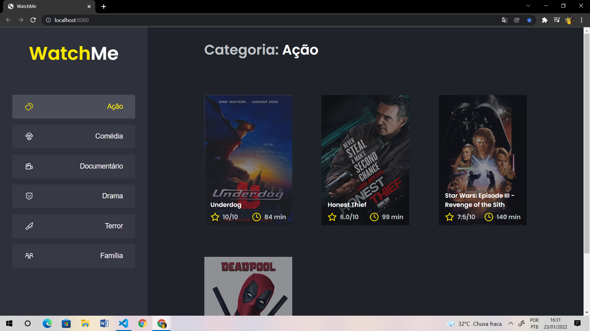

# Site de listagem de filmes feito em React

## O que faz?
- Faz uma listagem de filmes por gênero
- Consome um fake API utilizando o JSON Server

## Tecnologias utilizadas 
- React
- Typescript
- JSON Server

## Principais aprendizados
- Compartilhar um estado entre componentes
- Estrutura de componentes
- Utilização de componente pai para passar propriedades para seus filhos

## Como executar
- Clone o repositório utilizando o ```git clone link_do_repo```
- Abra a pasta do projeto no terminal e execute ```yarn``` para instalar as dependências
- Após instalar as dependências, abra dois terminais na pasta do projeto, no primeiro execute esse comando para executar a fake API: ```yarn server```, e no segundo execute esse comando para executar a aplicação: ```yarn dev```
- Pronto, com isso o site estará rodando na sua máquina! Sinta se confortável para mandar feedbacks de possíveis alterações!

<br><br><br>

